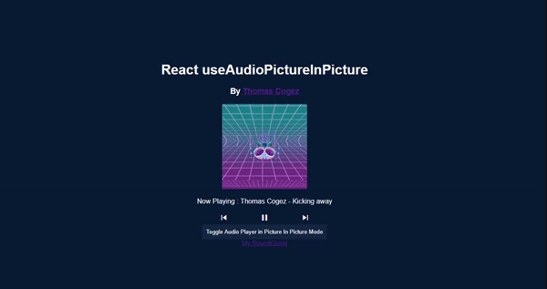

# useAudioPictureInPicture


> A react component that allow you to enable picture in picture mode on your audio player. The inspiration came from the open spotify player



[](https://www.npmjs.com/package/useaudiopictureinpicture) [](https://standardjs.com)

## Install

```bash
npm install --save useaudiopictureinpicture
```

or

```bash
yarn add useaudiopictureinpicture
```
## Demo

You can find a demo of the package [here](http://blind-test.me/useAudioPictureInPicture/)


## Usage

```jsx
import React, { Component } from 'react'

import { useAudioPictureInPicture } from 'useaudiopictureinpicture'

const Example = () => {
  //basic setup of the useAudioPictureInPicture hook
  const {isPipToggled, togglePip, updatePip} = useAudioPictureInPicture(initialImage, play, pause, previous, next)
}
```

(See the example directory for a complete example)
### Parameters:

| Parameter    | description                                                  | required? | default |
| ------------ | ------------------------------------------------------------ | --------- | ------- |
| initialImage | First image to display when picture in picture mode is enable | true      | null    |
| onPlay       | Function that would be trigger when the play button is pressed on the picture in picture frame | false     | null    |
| onPause      | Function that would be trigger when the pause button is pressed on the picture in picture frame | false     | null    |
| onPrevious   | Function that would be trigger when the previous button is pressed on the picture in picture frame | false     | null    |
| onNext       | Function that would be trigger when the next button is pressed on the picture in picture frame | false     | null    |

### Return:

| Name         | Type     | Description                                                  |
| ------------ | -------- | ------------------------------------------------------------ |
| isPipToggled | boolean  | State that represent the toggle state of the picture in picture |
| togglePip    | function | toggles state of PiP in document                             |
| updatePip    | function | see reference [here](./doc/updatePip.md)                     |

## License

MIT © [Thomascogez](https://github.com/Thomascogez)

---

This hook is created using [create-react-hook](https://github.com/hermanya/create-react-hook).
